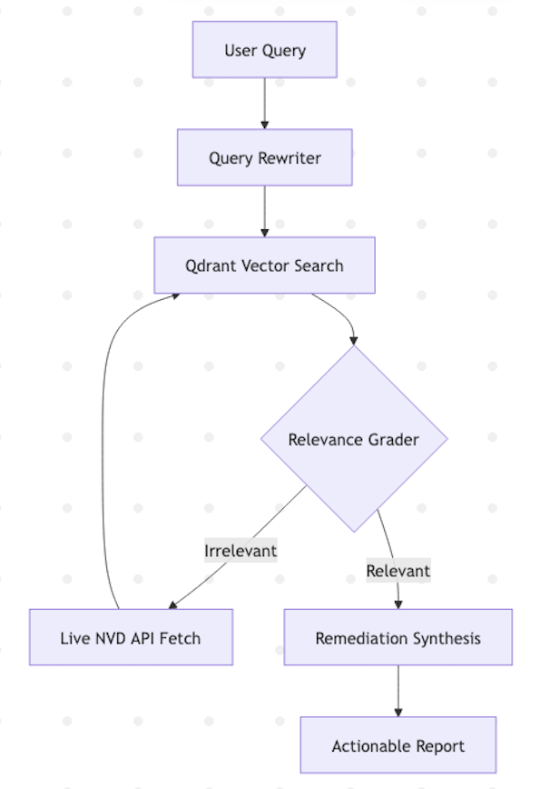
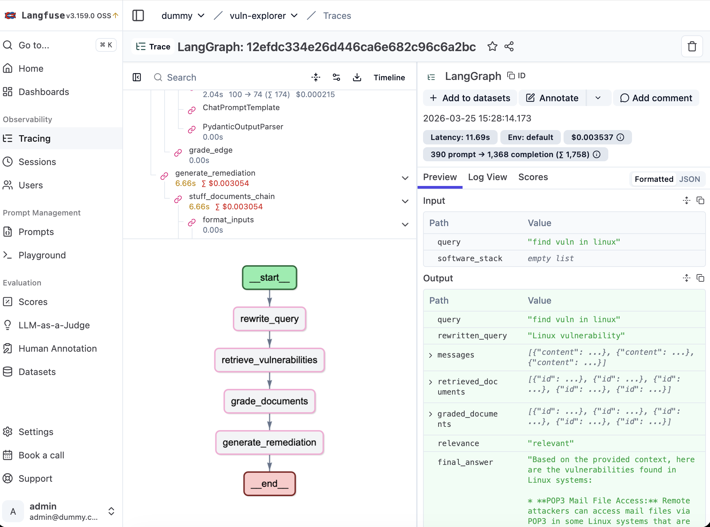

# Vuln Explorer

Vuln Explorer is a vulnerability intelligence system built around a read-only LangGraph inference pipeline and a separate ingestion workflow for NVD-backed document indexing. It is designed to turn raw security data into grounded answers, remediation guidance, and traceable evidence for analysts and platform teams.

The project combines Qdrant for retrieval, LangChain/LangGraph for orchestration, FastAPI for service delivery, Streamlit for the UI, and Langfuse for observability.

## Overview

- Ingestion is isolated under `src/ingestion/` and writes normalized, chunked vulnerability records into Qdrant.
- Inference is isolated under `src/agents/` and runs as a read-only LangGraph workflow.
- Retrieval is backed by Qdrant and can fall back to live NVD lookups when indexed evidence is insufficient.
- Responses are expected to stay grounded in retrieved CVE data rather than free-form generation.

## Architecture

The application is split into two operational paths:

1. Ingestion
   Fetches vulnerability data from NVD, normalizes it into `VulnerabilityRecord` objects, chunks content, and indexes the resulting documents into Qdrant.
2. Inference
   Rewrites the user query, retrieves relevant vulnerability documents, grades relevance, optionally fetches live NVD data, and generates a final answer from approved context.

Core modules:

- `src/ingestion/`: harvesting, normalization, and chunking
- `src/retrieval/`: retrieval adapters and search utilities
- `src/agents/`: LangGraph nodes, schema, handlers, and graph assembly
- `src/api/`: FastAPI service with `/health` and `/chat`
- `src/ui/`: Streamlit interface
- `src/core/`: model and embedding factory logic

## Tech Stack

- LangGraph for orchestration
- LangChain for prompts, chains, retrievers, and document abstractions
- Qdrant for vector storage
- OpenAI and Google Gemini model support via factory-based initialization
- FastAPI for API delivery
- Streamlit for the local UI
- Langfuse for tracing and debugging

## Project Layout

```text
.
├── src/
│   ├── agents/
│   ├── api/
│   ├── core/
│   ├── ingestion/
│   ├── retrieval/
│   ├── ui/
│   ├── config.py
│   └── models.py
├── docker-compose.yml
├── Dockerfile
├── main.py
└── requirements.txt
```

## Prerequisites

- Python 3.11
- Docker and Docker Compose for the containerized stack
- Access to either OpenAI or Google Gemini credentials
- Optional Langfuse credentials for tracing

## Configuration

Copy the template and provide the required environment values:

```bash
cp .env.template .env.dev
```

Important variables include:

- `QDRANT_URL`
- `QDRANT_COLLECTION`
- `MODEL_PROVIDER`
- `EMBEDDING_MODEL`
- `LANGFUSE_PUBLIC_KEY`
- `LANGFUSE_SECRET_KEY`
- `LANGFUSE_HOST`

Secrets must remain in environment files or runtime configuration and should never be committed.

## Local Development

Install dependencies:

```bash
pip install -r requirements.txt
```

Set the source path for local execution:

```bash
export PYTHONPATH=src
```

Run ingestion:

```bash
python main.py --ingest
```

Run an analysis query from the CLI:

```bash
python main.py --question "What vulnerabilities affect Apache Tomcat?" --stack tomcat
```

Run the API directly:

```bash
uvicorn src.api.main:app --host 0.0.0.0 --port 8000
```

## Docker Compose

Start the full local stack:

```bash
docker compose up --build
```

This launches:

- the application container
- the ingestion container
- Qdrant
- Langfuse and its supporting services

Default local endpoints:

- Streamlit UI: `http://localhost:8501`
- FastAPI: `http://localhost:8000`
- FastAPI health check: `http://localhost:8000/health`
- Langfuse: `http://localhost:3000`
- Qdrant: `http://localhost:6333`

## API

### `GET /health`

Returns a minimal service health payload.

### `POST /chat`

Request body:

```json
{
  "message": "List critical CVEs affecting nginx"
}
```

Response shape:

```json
{
  "final_generation": "Grounded answer text",
  "retrieved_documents": [
    {
      "page_content": "Document text",
      "metadata": {}
    }
  ]
}
```

## Inference Workflow

The current LangGraph pipeline is assembled in `src/agents/graph.py` and follows this sequence:

1. Rewrite the incoming query for retrieval.
2. Search Qdrant for relevant vulnerability records.
3. Grade the retrieved context for relevance.
4. Fall back to live NVD lookup when indexed results are weak.
5. Generate a grounded remediation-oriented answer.

This separation keeps write operations in ingestion and preserves a read-only inference path.

## Testing

Run the test suite with:

```bash
pytest -v
```

## Screenshots

System workflow:



UI:


Langfuse tracing:



## Status

WIP


